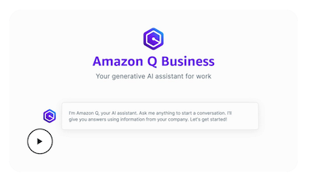

# Official Resources
{: .no_toc }

  

    Table of contents
  

  {: .text-delta }
1. TOC
{:toc}

| [Amazon Q Home](https://aws.amazon.com/q/) | [Amazon Q Docs](https://docs.aws.amazon.com/amazonq/) |
| [Amazon Q community](https://community.aws/amazon-q) | [Amazon Q pricing plans](https://aws.amazon.com/q/pricing/) |

## Amazon Q Developer

- [Amazon Q User Guide: Code examples](https://docs.aws.amazon.com/amazonq/latest/qdeveloper-ug/inline-suggestions-code-examples.html)
- [Amazon Q Developer change log](https://aws.amazon.com/developer/generative-ai/amazon-q/change-log/)

## Amazon Q Business

- [Getting started with Amazon Q Business](https://docs.aws.amazon.com/amazonq/latest/qbusiness-ug/getting-started.html)

## AWS Solutions Library

- [Guidance for Creating a Customized Coding Companion with Amazon Q Developer](https://aws.amazon.com/solutions/guidance/creating-a-customized-coding-companion-with-amazon-q-developer/)

## Tooling & workshops

- Workshops:
  - [Amazon Q Developer - Building the Q-Words App](https://catalog.workshops.aws/qwords/en-US)
  - [Amazon Q Developer - Deep Dive](https://catalog.us-east-1.prod.workshops.aws/workshops/e2226eb6-f109-47ae-b2c5-f02bf73b7d0e/en-US)
- GitHub repos:
  - [aws/mynah-ui](https://github.com/aws/mynah-ui), a data & event driven chat 
  interface library for browsers and webviews
  - [aws/aws-toolkit-vscode](https://github.com/aws/aws-toolkit-vscode),
  a VS Code extension for connecting your IDE to Amazon Q and leveraging generative
  AI to accelerate your software development

## Videos

re:Invent 2024
{: .label .label-green }

[")](https://www.youtube.com/watch?v=iQ_8YtgLAtI)
Accelerate application maintenance and upgrades with generative AI (DOP209)
{: .text-grey-dk-000 }

Modernize mainframe applications faster using Amazon Q Developer (DOP221)
{: .text-grey-dk-000 }

What’s new with Amazon Q Developer agents (DOP223)
{: .text-grey-dk-000 }

Build Amazon Q apps to scale and drive community engagement (DEV201)
{: .text-grey-dk-000 }

Boosting productivity with Amazon Q Developer agents (DEV202)
{: .text-grey-dk-000 }

Implementing Amazon Q Developer: Lessons from the field (DEV310)
{: .text-grey-dk-000 }

What’s new with Amazon Q Business (AIM237)
{: .text-grey-dk-000 }

re:Invent 2023
{: .label .label-green }

Best practices for Amazon CodeWhisperer (DOP201)
{: .text-grey-dk-000 }

Realizing the developer productivity benefits of Amazon CodeWhisperer (DOP202)
{: .text-grey-dk-000 }

